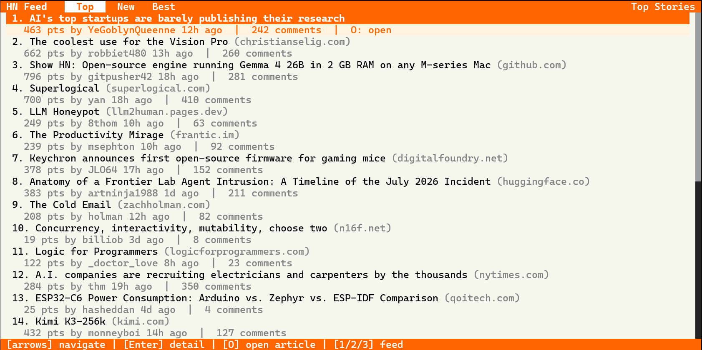

# OpenTUI-HackerNews




Hacker News reader in your terminal. Browse top, new, and best stories with threaded comments — no browser needed.

## Install & Run

```bash
git clone https://www.github.com/anjulbhatia/OpenTUI-HackerNews
cd OpenTUI-HackerNews
bun install
bun run dev
```

**Keys**: `↑↓` navigate · `Enter` comments · `O` open article · `1/2/3` switch feed · `ESC` back · `Q` quit
